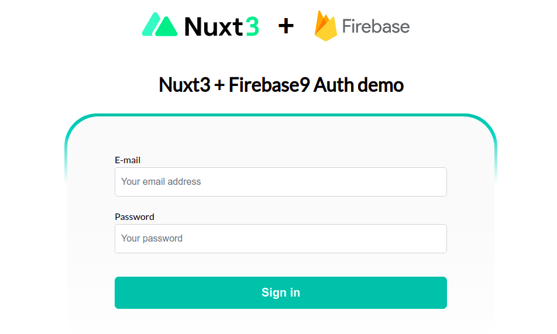

# Nuxt3 minimal starter with Firebase Authentication integrated + PrimeVue

Authenticated server-side rendering with Nuxt 3 and Firebase 9



## Features
- [💚 Nuxt 3](https://nuxt.com) - SSR, ESR, File-based routing, components auto importing, modules, etc. Are you new in Nuxt3? We recommend to look at the [documentation](https://nuxt.com/docs).

- 🔥 The `<script setup>` syntax

- 🚠 Firebase v9 for Firebase Authentication services (client side authentication)

- 🚀 The PrimeVue for styled components

- 🚦 VeeValidate for input forms with i18n support

- 📥 APIs auto importing - for Composition API, VueUse and custom composables.

- 🦾 Mainly TypeScript

## IDE

We recommend using [VS Code](https://code.visualstudio.com/) with [Volar](https://github.com/johnsoncodehk/volar) to get the best experience (You might want to disable Vetur if you have it).


## Setup
Make sure to install the dependencies

```bash
npm install
```

## Firebase setup
First of all, you need to create [Firebase](https://firebase.google.com/docs/auth/web/start?) acount and SDK setup.
You need to create `.env` file with this content from Firebase project (security credentials should never be shared):
```bash
cp .env.example .env
```

Set [service account](https://firebase.google.com/docs/admin/setup#initialize-sdk) environment variable:
```
FIREBASE_API_KEY=
```

## Development
Start the development server on http://localhost:3000

```bash
npm run dev
```

## Preview

Delete .output folder and run below commands

```bash
npm run build
npx nuxi preview
```

## Production

### * [Deploy nuxt with Firebase Hosting (Blaze Plan needed)](https://nitro.unjs.io/deploy/providers/firebase)

### * [Deploy nuxt with Vercel](https://nitro.unjs.io/deploy/providers/vercel)

### * [Deploy on others PaaS with Nitro](https://nitro.unjs.io/deploy/)

## References
- [Nuxt3 (Stable)](https://nuxt.com)
- [Firebase 9](https://firebase.google.com)
- [Primevue](https://www.primefaces.org/primevue/#/)
- [VeeValidate 4](https://vee-validate.logaretm.com/v4/)